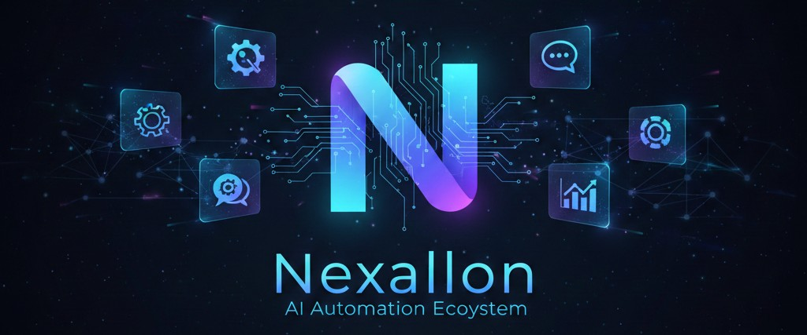

# 🚀 Nexallon (NXN) - The Future of AI-Driven Business Autonomy

  

## 🎯 Project Goal
Nexallon aims to democratize access to advanced AI automation. Our goal is to provide a "Plug-and-Play" ecosystem where businesses and individuals can deploy intelligent bots to handle complex tasks, saving thousands of hours and reducing operational costs.

## 🛠 How It Works: Tech Stack & Security
- **Telegram Interface:** Our bots live where you work. We use Telegram for its high security, speed, and ease of use on mobile and desktop.
- **Blockchain Data Integrity:** Critical transaction data and user permissions are hashed and stored on the **Solana Blockchain**. This ensures transparency while maintaining record immutability.
- **Military-Grade Encryption:** All proprietary AI logic and sensitive user data are encrypted using **AES-256 standards** before being processed, ensuring that your "Business Secret Sauce" stays yours.

## 💼 Business & Marketing Applications
Nexallon is designed to scale across multiple industries:

### 1. Digital Marketing & Content
- **Auto-Content Engine:** Turn one idea into 10+ social media posts across platforms.
- **Trend Analysis:** AI bots that scan market trends and suggest marketing strategies in real-time.

### 2. Business Management & CRM
- **Smart Support:** AI-powered customer service bots that handle FAQs and lead generation 24/7.
- **Workflow Automation:** Automating repetitive tasks like data entry, scheduling, and invoicing.

### 3. E-Commerce & Web3
- **Order Tracking:** Real-time updates for customers via Telegram.
- **Token-Gated Services:** Exclusive features for $NXN holders, verified instantly on-chain.

## 🚀 How to Use Nexallon
1. **Connect:** Add the official Nexallon Bot on Telegram.
2. **Authenticate:** Link your Solana wallet (e.g., Phantom) to verify your $NXN holdings.
3. **Deploy:** Select a bot from the "Service Marketplace" and start automating your first task in seconds.

---
